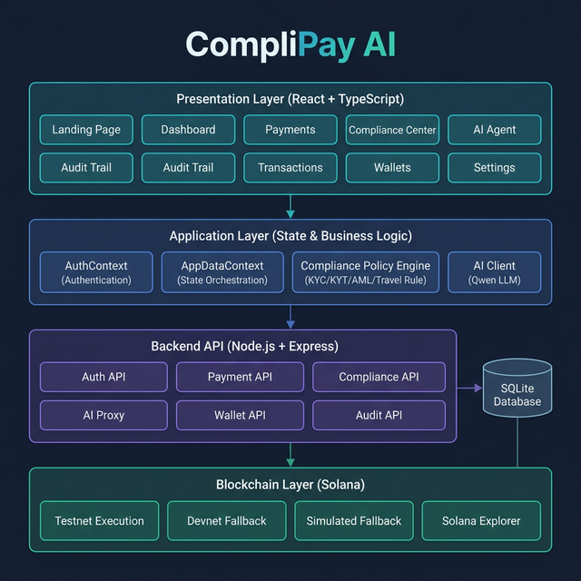
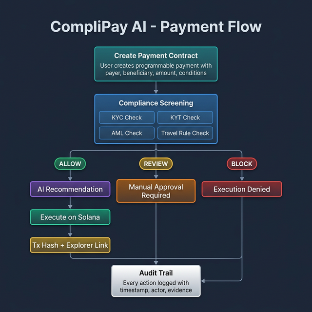
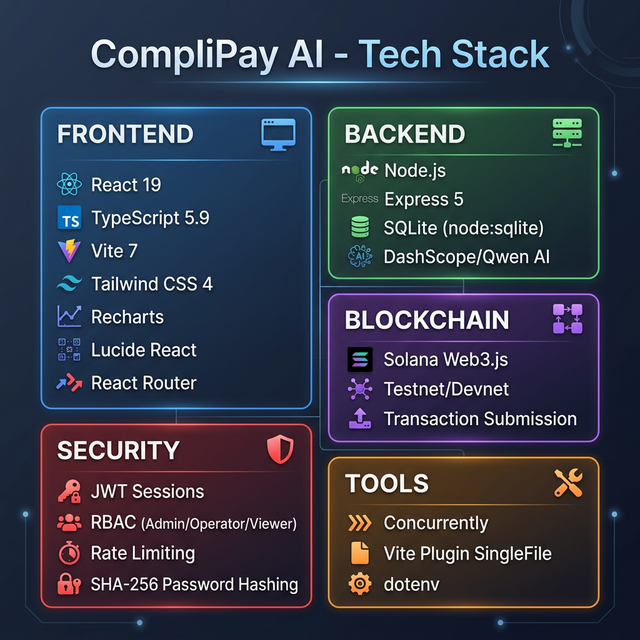

# CompliPay AI

Updated: March 19, 2026 (Asia/Jakarta)
Status: Demo-ready and deployed on Vercel
Production readiness estimate: about 90%

CompliPay AI is a full-stack programmable stablecoin operations platform for institutional workflows.
It combines policy checks (KYC, KYT, AML, Travel Rule), guarded execution, AI assistance, and auditable evidence.

## Live Deployment

- App: `https://compli-pay-ai.vercel.app/`
- Health check: `https://compli-pay-ai.vercel.app/api/health`

Expected health response shape:

```json
{
  "ok": true,
  "aiConfigured": true,
  "model": "qwen-plus",
  "persistence": "sqlite+postgres-snapshot"
}
```

`persistence` can be:
- `sqlite` (local-only persistence)
- `sqlite+postgres-snapshot` (SQLite snapshot synced to Postgres through `DATABASE_URL`)

## What Is Already Implemented

### Core platform
- React + TypeScript frontend with protected routes.
- Express backend with API endpoints under `/api/*`.
- SQLite primary store (`server/data/complipay.db`) with WAL mode.
- Optional remote snapshot persistence to Postgres via `DATABASE_URL`.

### Auth and access control
- Email/password login with demo users.
- PBKDF2 password hashing with legacy hash migration.
- Session token hashing at rest.
- RBAC for sensitive actions:
  - `admin` and `operator`: create/run/execute/resolve/refresh
  - `viewer`: read-only behavior

### Payment operations
- Create programmable payment contracts.
- Run compliance evaluation.
- Request AI recommendation.
- Execute manually or with AI mode.
- Batch execute selected `ALLOW` contracts.

### Compliance and evidence
- Deterministic compliance decision: `allow`, `review`, `block`.
- Persistent compliance alerts with resolve action.
- Transactions page with evidence and CSV export.
- Audit trail page with append-only lifecycle records.

### UI updates already applied
- Sidebar auto-expand on hover (desktop) and auto-hide on mouse leave.
- Login page has password visibility toggle.
- Login page has `Back to Landing` button (English).
- Batch action label clarifies eligibility: `Batch Execute ALLOW`.

## Architecture Summary

- Frontend: `src/`
  - `AuthContext` for session lifecycle
  - `AppDataContext` for bootstrap + state mutations
- API runtime: `server/server.js`
  - Auth, bootstrap, payments, compliance, execution, wallets, AI chat
- Vercel adapter:
  - `api/index.js` rewrites `/api/:path*` to Express app
  - `api/_app.js` exports Express handler
- Persistence:
  - Local SQLite as source of truth at runtime
  - Optional snapshot mirror to Postgres (for serverless durability)
- Chain integration:
  - Solana execution path with simulation fallback

For full details, see [`docs/ARCHITECTURE.md`](docs/ARCHITECTURE.md).

## Visual Diagrams

### System Architecture



### Payment Flow



### Tech Stack



## Local Development

### Prerequisites
- Node.js 22+
- npm

### Install

```bash
npm install
cp .env.example .env
```

Set at least:

```env
DASHSCOPE_API_KEY=your_key
AUTH_PASSWORD_SALT=your_long_random_value
SESSION_TOKEN_PEPPER=another_long_random_value
AUTH_PBKDF2_ITERATIONS=210000
SESSION_TTL_HOURS=24
TRUST_PROXY=false
```

Then run:

```bash
npm run dev
```

Local URLs:
- Frontend: `http://localhost:5173`
- API: `http://localhost:8787`
- API health: `http://localhost:8787/api/health`

## Environment Variables

### Required for secure deployment

| Variable | Example | Purpose |
|---|---|---|
| `AUTH_PASSWORD_SALT` | long random string | Password hash salt and legacy migration support |
| `AUTH_PBKDF2_ITERATIONS` | `210000` | PBKDF2 work factor |
| `SESSION_TOKEN_PEPPER` | different long random string | Hashes session tokens before DB storage |
| `SESSION_TTL_HOURS` | `24` | Session duration |
| `TRUST_PROXY` | `1` (Vercel) or `false` (local direct) | Correct client IP behavior for rate limiting |
| `DASHSCOPE_API_KEY` | provider key | Enables AI chat and recommendation |
| `AI_BASE_URL` | `https://dashscope-intl.aliyuncs.com/compatible-mode/v1` | OpenAI-compatible endpoint |
| `AI_MODEL` | `qwen-plus` | Model name |

### Optional but recommended

| Variable | Purpose |
|---|---|
| `DATABASE_URL` | Enables SQLite snapshot sync to Postgres for persistence in serverless runtime |
| `CORS_ORIGIN` | Restrict browser API origins |
| `SOLANA_RPC_ENDPOINT` | Override RPC endpoint |
| `USDC_TOKEN_MINT` / `USDT_TOKEN_MINT` | Better SPL balance accuracy |
| `SPL_DEFAULT_DECIMALS` | Token decimal override |
| `COMPLIANCE_PROVIDER_URL` / `COMPLIANCE_PROVIDER_KEY` | Optional external compliance provider |

### Vercel + Supabase pattern

- Keep API and frontend in same Vercel project so `/api/*` is same origin.
- Use Supabase **Session pooler** URI for `DATABASE_URL` (IPv4 friendly).
- After adding/updating env vars, trigger redeploy.
- Verify with `/api/health` that `persistence` reports `sqlite+postgres-snapshot`.

## API Reference (Current)

### Public
- `GET /api/health`
- `POST /api/auth/login`

### Authenticated
- `GET /api/auth/me`
- `POST /api/auth/logout`
- `GET /api/bootstrap`
- `POST /api/ai/chat`

### Admin/Operator
- `POST /api/payments`
- `POST /api/payments/:id/compliance`
- `POST /api/payments/:id/ai-recommendation`
- `POST /api/payments/:id/execute`
- `POST /api/payments/batch-execute`
- `POST /api/compliance/alerts/:id/resolve`
- `POST /api/wallets/refresh`

## Demo Credentials

- Admin: `admin@complipay.ai` / `Admin123!`
- Operator: `ops@complipay.ai` / `Ops123!`
- Viewer: `viewer@complipay.ai` / `View123!`

## Fast Demo Flow (3 Minutes)

1. Login as admin.
2. Create payment contract in Payments page.
3. Run compliance and show `ALLOW/REVIEW/BLOCK` decision.
4. Show AI recommendation.
5. Execute payment (`Execute Now` or `Execute With AI`).
6. Show transaction evidence in Transactions page.
7. Show lifecycle log in Audit Trail page.

Detailed script: [`docs/DEMO_RUNBOOK.md`](docs/DEMO_RUNBOOK.md)

## Known Gaps

- Automated test suite is still limited.
- Backend is still monolithic (`server/server.js`).
- OpenAPI contract is not published yet.
- Settings and some integration panels are still demo-oriented.

## Documentation Index

- Architecture: [`docs/ARCHITECTURE.md`](docs/ARCHITECTURE.md)
- Roadmap: [`docs/ROADMAP.md`](docs/ROADMAP.md)
- Demo script: [`docs/DEMO_RUNBOOK.md`](docs/DEMO_RUNBOOK.md)
- Security rollout: [`docs/SECURITY_ROLLOUT_RUNBOOK.md`](docs/SECURITY_ROLLOUT_RUNBOOK.md)
- Completion audit: [`docs/PROJECT_COMPLETION_AUDIT.md`](docs/PROJECT_COMPLETION_AUDIT.md)
- Full audit report: [`docs/PROJECT_AUDIT_REPORT.md`](docs/PROJECT_AUDIT_REPORT.md)
- Submission checklist: [`docs/SUBMISSION_CHECKLIST.md`](docs/SUBMISSION_CHECKLIST.md)
- UI/UX blueprint: [`docs/UI_UX_DESIGN.md`](docs/UI_UX_DESIGN.md)

## Current Readiness Snapshot

- Demo/MVP readiness: very high
- Production-demo readiness estimate: about 90%
- Backend on Vercel `/api/*`: validated
- Persistence `DATABASE_URL` snapshot: validated
- Remaining priority before final submission:
  - run repeated dry-runs,
  - produce final Loom video,
  - lock final submission metadata and proof.
